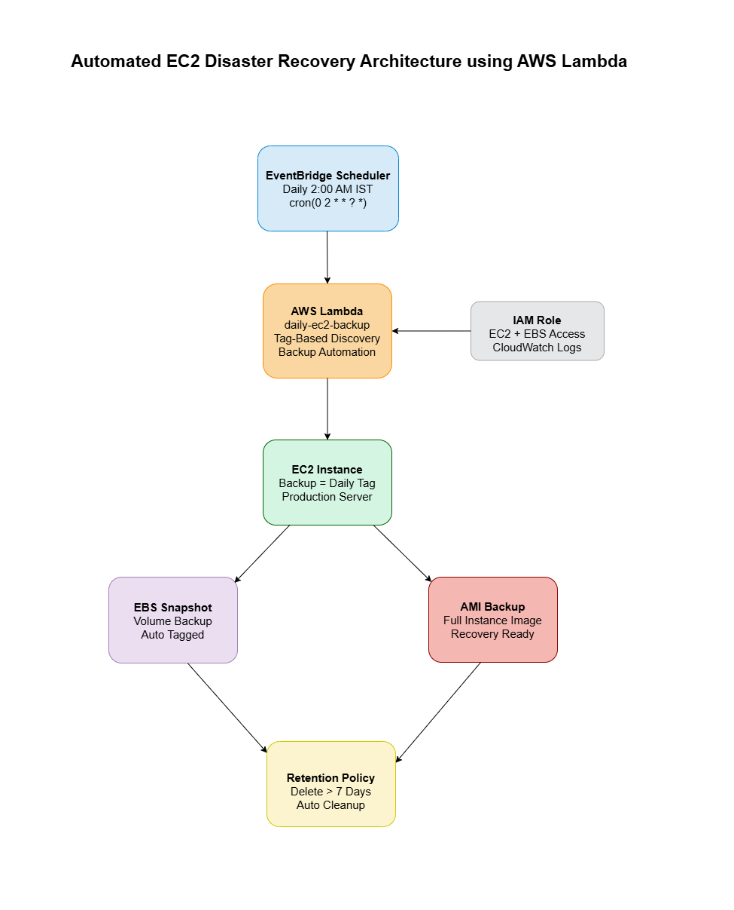

# Automated Disaster Recovery System using AWS Lambda & EventBridge

## 📌 Project Overview
This project implements an automated disaster recovery solution for AWS EC2 instances using a serverless architecture. It enables scheduled EBS snapshot creation and AMI backups to ensure data protection and rapid system recovery in case of system failure.

## 🧨 Problem Statement
In production environments, EC2 instance failures due to disk corruption, accidental deletion, ransomware attacks, or region outages can lead to downtime and data loss.

Manual backup processes are inefficient and prone to human error.

## 🛠️ Solution Implemented
Designed and deployed a serverless automation pipeline that:

- Identifies EC2 instances using tag-based filtering
- Automatically creates EBS snapshots and AMIs
- Schedules nightly backups using Amazon EventBridge
- Applies 7-day retention policy for cost optimization
- Deletes outdated backups automatically
- Implements exponential backoff to handle AWS snapshot API throttling

## 🧰 AWS Services Used
- Amazon EC2
- Amazon EBS
- AWS Lambda
- Amazon EventBridge Scheduler
- IAM

## 🔄 Automation Workflow
EventBridge Scheduler (2 AM IST)
↓
AWS Lambda
↓
EC2 Instance Discovery (Tag-Based)
↓
EBS Snapshot Creation
↓
AMI Creation
↓
Retention Policy Cleanup (>7 Days)

## 🏗️ System Architecture

## 📸 Deployment Proofs

Refer to : docs/proofs/

## 📈 Key Outcomes
- Eliminated manual backup dependency
- Improved disaster recovery readiness
- Implemented cost-efficient backup retention
- Handled AWS API rate limits using retry logic